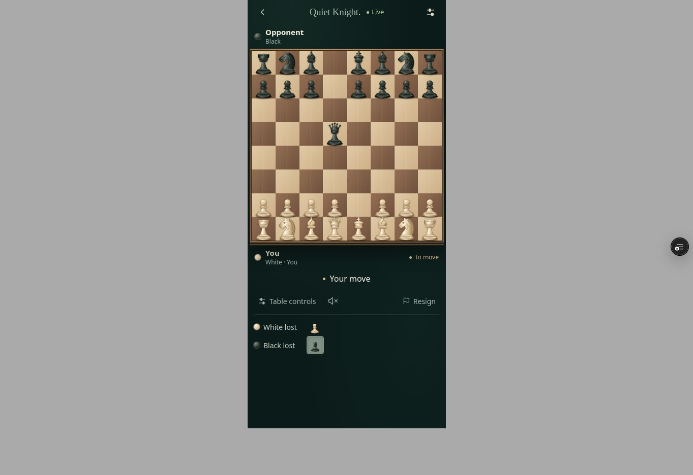

# Captured-piece visibility repair — 2026-09-09

AppDeploy v39 / 1788967016761, https://quiet-knight-live-v2xp3y.v2.appdeploy.ai/
Label unchanged: QK • Games remembered.
Rollback: v38 / 1788963980631.
Source commit: 08743a6db4261b945c09857d4885da5899d3ac78.

User reported the lost-piece rows had disappeared from live play. Inspection confirmed CapturedPieces still existed but rendered only inside Table controls. Normal play now shows the existing White lost and Black lost rows below contextual actions, with 28×32px carved piece icons and 14px labels. Zen retains these rows inside Table controls. Capture accounting, board layout, engine, multiplayer, identity, scoring, service worker and infrastructure are unchanged.

ACTUALLY VERIFIED:
- Rendered current component with a legal e4 d5 exd5 Qxd5 fixture; both rows show a pawn of the corresponding lost color.
- 390×844 and 360×844 phone frames, both orientations. At 360px the two rows end at y674 and stay within width348; first viewport contains both.
- Desktop fixture and Zen opening Table controls show correct capture rows.
- AppDeploy v39 ready, no frontend/network QA errors; e2e null is not a pass.
- Actual production resumed the saved computer game and showed both visible loss rows (None in that saved position), with no relevant app console errors.
- Applied chess-ui source matches the rendered candidate, excluding trailing whitespace.

DETERMINISTIC / SOURCE TESTED:
- TypeScript and Vite build passed.
- Existing capture/material suite passed en passant, recapture, promotion, capture of promoted pieces and audio semantics.
- Post-game loss/history suite passed.
- tests/tests.txt reconciled with normal versus Zen capture visibility.

NOT PHYSICALLY VERIFIED:
- No new two-phone game/capture synchronization certification.
- Populated capture rows were rendered with a legal replay fixture; the resumed production position had no captures.
- No physical phone, audio or installed-PWA relaunch test.
- Railway unchanged; the existing Quiet Review infrastructure hold remains.

Temporary QA deployment: dpl_D6FYxuLJNhkdvcXdxJrbTvrFjfi2, READY.

