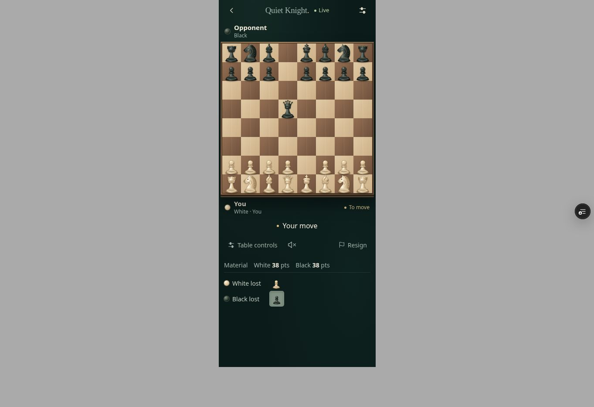

# Material points restored — 2026-09-09

Production v41 / 1788969015839, https://quiet-knight-live-v2xp3y.v2.appdeploy.ai/
Rollback v40 / 1788967944986. Label remains QK • Games remembered.
Source commit: 02822bc74261a89f017dd94e46cd64f451842b5f.

Restored a compact Material · White N pts · Black N pts line above the two loss rows. Nonzero material advantage is shown unobtrusively. It appears in normal and Zen modes. Detailed material legend remains in Table controls. Uses the existing materialTotals function: current pieces, king excluded. Knight ID Quiet Points and all engine/backend/network/identity/scoring code are unchanged.

ACTUALLY VERIFIED:
- 360×844 rendered Zen fixture after e4 d5 exd5 Qxd5: White 38 pts, Black 38 pts; both lost pawns remain visible. No clipping or app console errors observed.
- Actual v41 production resumed the saved computer game with Zen still enabled: White 39 pts, Black 39 pts, both loss rows present.
- Production console clean; AppDeploy ready with no frontend/network QA errors. E2e result null, not a pass.
- Screenshot evidence below.

DETERMINISTIC / SOURCE TESTED:
- TypeScript and Vite build passed.
- Existing material/capture suite passed 39/39 start, en passant/recapture, promotion, promoted-queen capture and king exclusion.
- UI workflow expectations reconciled for visible material in both modes.

NOT PHYSICALLY VERIFIED:
- No new physical phone, two-client live capture sequence or installed PWA relaunch test.
- Captured-position material was rendered from a legal replay fixture; actual resumed production position had no captures.
- User's device display not directly accessible.

