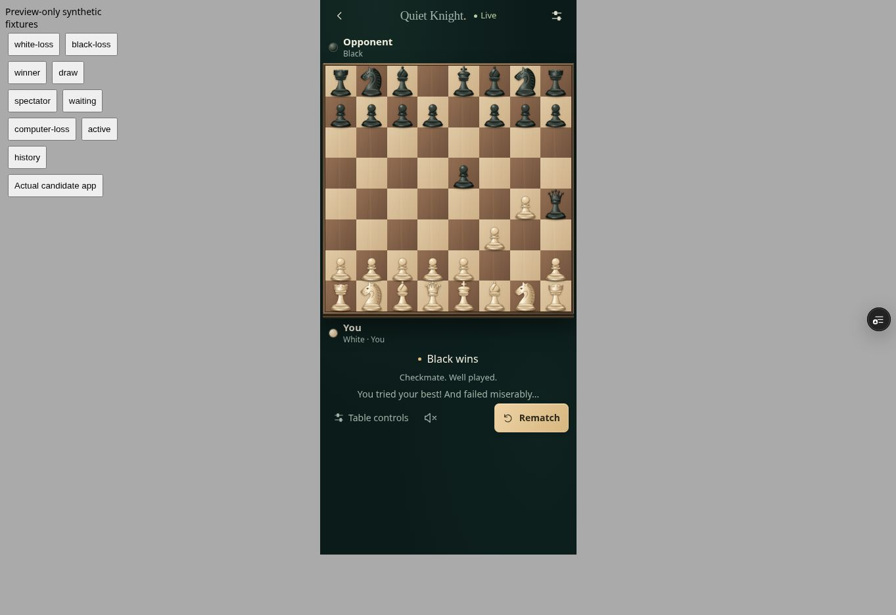
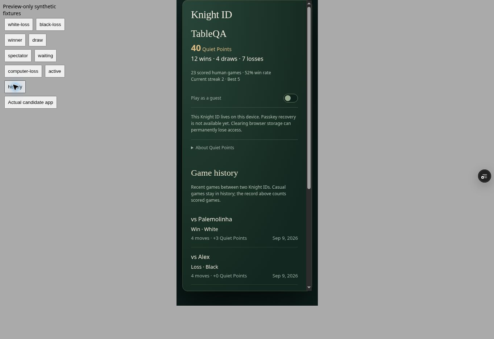
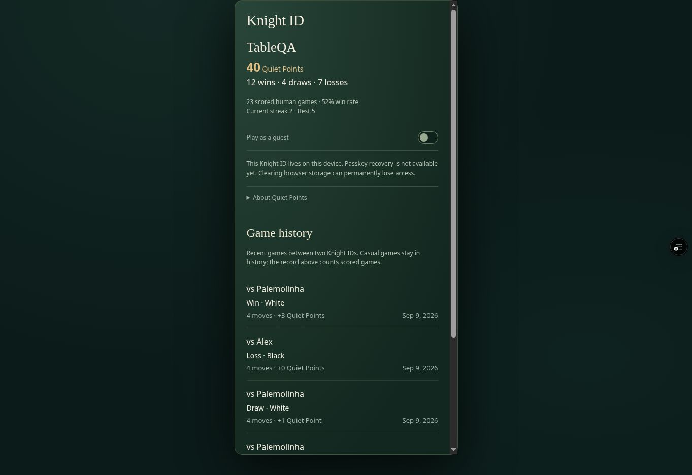
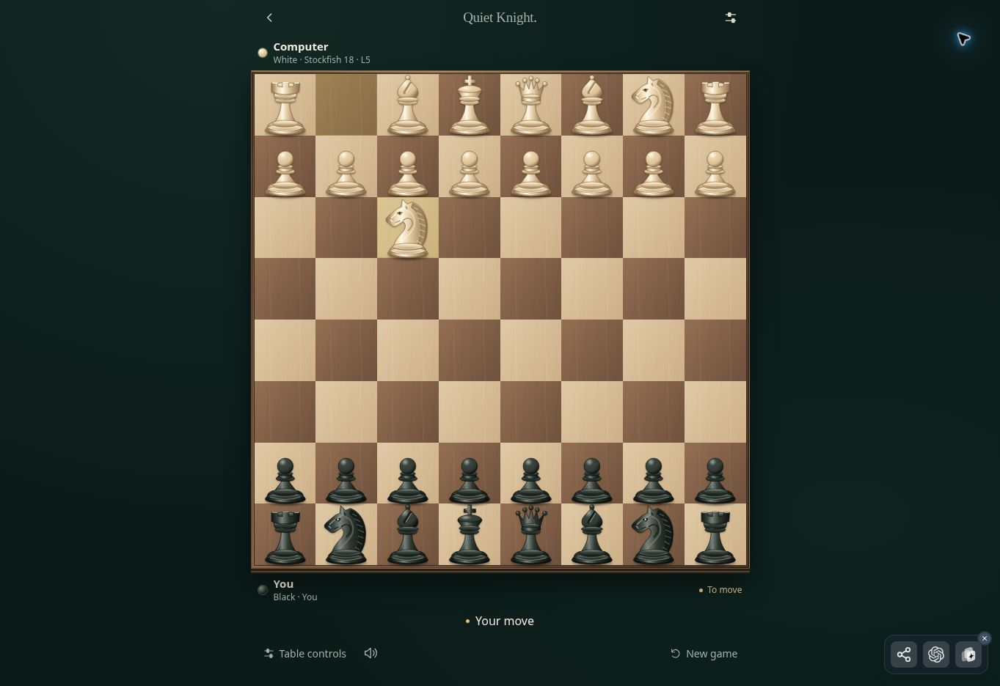

# Quiet Knight — post-game release, 2026-09-09

## Exact production
- AppDeploy app: quiet-knight-live-v2xp3y
- URL: https://quiet-knight-live-v2xp3y.v2.appdeploy.ai/
- Applied release: v38 / snapshot 1788963980631
- Source label: QK • Games remembered (numeric version deliberately omitted until AppDeploy allocated it)
- Immediate rollback: v37 / 1788920004629. Earlier fallback: v36 / 1788913697012.
- Source commit: 86da8eccf3663876d429374d888c9cce202ef212 on quiet-knight-postgame-2026-09-09.
- All six deployed files read back from the applied snapshot and matched the tested source exactly.

## Shipped scope
LIVE: exact losing-player text “You tried your best! And failed miserably...” below the ordinary result. Guard uses the current owned color and authoritative winner for room games, human color and checkmate result for computer games. It excludes draws, winners, spectators, active/waiting games.
LIVE: Knight ID Game history. Authoritative lifetime Quiet Points, W/D/L, scored-game count, win rate and streaks remain sourced from /players/me. Rows use durable player IDs, result, stored points, moves and ended_at. Eligible rows require two different Knight IDs and the current player. Casual rows show No points.
NOT CHANGED: v37 board geometry, pieces, table hierarchy, multiplayer, seat handling, engine, network, service worker, scoring, H2H, identity authentication and storage.
HELD: history pagination/latest 20. The deployed /players/me query returns at most eight recent records; the UI shows every eligible returned record rather than the previous five-row slice. There may be fewer than eight after filtering. Lifetime totals are never derived from this truncated list.
HELD: Quiet Review backend and frontend. No review action was exposed without its backend.

## Railway and storage
Direct status after release:
- Server deployment: 743ce873-7afa-41b1-8bee-6c8f031e7c2e, SUCCESS.
- Backend build: qk-server-2026-09-08-r5-table-presence.
- Deployed source commit: 02e9c1f866ac9eefdb44f09d147067b42530280d.
- Postgres deployment: 52fd82d2-bb3a-4d16-8cbb-4d142ac56fab, SUCCESS.
- Postgres volume: e6c3c959-cc46-488b-8402-56582c36bf6a, /var/lib/postgresql/data, 500 MB.
- Redis deployment: eca0ab1e-606a-4800-aa1e-e089afa508e0, SUCCESS; no volume.
- Mixed staged patch remains 3b485ae1-3c4f-4677-a2d0-dacdef826ffc, STAGED, 21 changes, including unwanted Postgres configuration.
No Railway Agent was used. No infrastructure mutation was attempted. Available direct tools did not expose a safely verifiable way to isolate the intended source deployment from that mixed patch.

Existing Quiet Review work remains on main and quiet-knight-review-rebase-2026-09-09, including continuation-2026-09-09/REPORT.md. It must be logically rebased onto v38 before a future frontend release; do not copy old complete frontend files.

## ACTUALLY VERIFIED
### Production
- Current production was v37 before release; deployment allocated v38 and reached ready.
- Actual v38 URL rendered the new label.
- Stockfish 18 level 5 opened Nf3 with the human playing Black; the UI then showed Your move.
- Before release, actual v37 Stockfish answered e4 with c5 while the human played White.
- Actual v38 Black orientation: 64 equal 83.75 × 83.75 px cells in a 670 × 670 px desktop board.
- Table controls opened and closed; material, captures, move history, preferences and diagnostics remained accessible.
- No relevant application error/warning in the inspected browser console; browser-extension metadata errors were excluded and are not app errors.
- Home retained Resume saved computer game and reported Computer files saved for offline play after preparation.
- Direct Railway status confirmed unchanged successful service deployments.
### Rendered candidate fixtures (not production account/scoring tests)
- 390 × 844 mobile board width 374 px; 360 × 844 board width 344 px with 64 equal 43 × 43 px cells.
- Black and White loser presentations; winner, draw, spectator and waiting exclusions.
- Understated loser text, existing player strips/result and table layout preserved.
- History summary, stored +3/+1/+0, casual No points, and excluded guest/self rows rendered correctly.
- Selected history fixture opened the existing final-position component with the correct final board. Copy PGN and Copy FEN reported success.
- Table controls and Escape close exercised on the candidate; selected pawn exposed the legal e4 destination.
- Desktop history rendered at 1363 × 936 without horizontal overflow.
- Candidate guest computer game received a correctly labelled local fallback reply (Nc6). This is not an online Stockfish preview certification.
- Screenshots: mobile loss, mobile history, desktop history, actual v38 production.

## DETERMINISTIC/SOURCE TESTED
- TypeScript noEmit and Vite production build passed.
- verify-postgame.cjs: both losing colors, winners, draws, spectators, waiting, human computer-game loss; stored point values; casual state; history eligibility; all eight eligible returned records; durable summary independent of recent rows; current GameApp wiring.
- Existing verify-phase2.cjs passed material/capture/promotion/audio semantics.
- Existing verify-keepsakes.cjs passed PGN/FEN and bounded completed-game memory.
- Existing verify-stockfish-frontend.cjs passed adapter/fallback/stale-reply guards.
- Deployed backend identity.js inspected at commit 02e9c1f866ac9eefdb44f09d147067b42530280d: Postgres durable statistics and recent-game query LIMIT 8.
- Computer games have no multiplayer scoring-ledger path; source behavior unchanged.
- AppDeploy e2e result was null, not a pass. AppDeploy QA snapshot reported no frontend/network errors.

## NOT PHYSICALLY VERIFIED
- No new two-phone multiplayer, background/foreground, physical audio/haptics or installed-PWA airplane-mode relaunch certification in this pass. André previously reported successful v37 two-phone play.
- The available work browser did not provide two genuinely isolated frontend contexts. Shared tabs were not counted as two players.
- No new real production Knight ID scoring/history-reload acceptance; populated history and exports used labelled fixtures. Existing persistence/API code was inspected and preserved.
- New loser line was rendered with fixtures and source-tested, not observed after a newly completed physical two-phone match.
- Quiet Review backend/frontend are not live; production cache, White/Black review access, deadline/busy/cancellation, and room/score/game-number non-mutation were not executed in this release.
- Offline readiness is a browser UI observation; cache inventory and network-disabled relaunch were not recertified here.

## Temporary preview
- Existing Vercel QA project: quiet-knight-mobile-qa.
- Deployment: dpl_Cxbg16inopDFpQ6n3Nv4GHzNXKPC, READY.
- URL: https://quiet-knight-mobile-1eiy583rv-andre-fikers-projects.vercel.app
- Preview used a temporary share access mechanism; it is not the production host.
- QA fixtures are only on this preview, not in AppDeploy production.

## Evidence

Stop: Release A shipped and checked. Quiet Review remains held at the explicit infrastructure safety gate.
